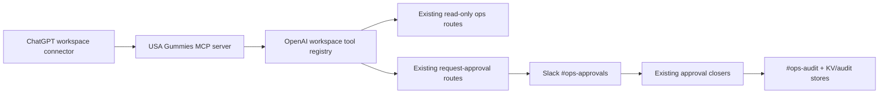

# OpenAI ChatGPT Workspace Agents Integration

**Status:** Phase 1 shipped — read-only MCP search/fetch connector
**Owner:** Ben  
**Last updated:** 2026-04-29

## 1. Decision

Do **not** build a second agent stack inside ChatGPT.

Use ChatGPT workspace agents as a **workspace surface** over the existing USA Gummies control-plane:

- ChatGPT can read approved ops surfaces and synthesize answers.
- ChatGPT can prepare or request registered Slack approvals.
- ChatGPT cannot directly execute QBO, Gmail, ShipStation, Shopify checkout, HubSpot stage/property, Faire API, pricing, cart, bundle, or inventory writes.
- Slack remains the command / approval / audit surface.
- Existing closers remain the only execution layer after human approval.

This preserves the current doctrine: one source of truth per domain, fail-closed unknown approval slugs, and no silent autonomous writes.

## 2. Why This Fits OpenAI's Current Surface

OpenAI's current ChatGPT connector path supports custom connectors using MCP. The relevant docs say custom connectors bring internal systems into ChatGPT via MCP, and Business / Enterprise / Edu admins can publish connectors for workspace users. The MCP guide requires a connector to expose `search` and `fetch` for ChatGPT connector / deep research compatibility. The Responses API and Agents SDK are better for building standalone agentic applications; they are **not** the first choice for this workspace UX because our approval/control-plane already exists.

Official references:

- [Connectors in ChatGPT](https://help.openai.com/en/articles/11487775-connectors-in-chatgpt)
- [Building MCP servers for ChatGPT and API integrations](https://platform.openai.com/docs/mcp/)
- [ChatGPT Developer mode](https://platform.openai.com/docs/developer-mode)
- [Responses API migration guide](https://platform.openai.com/docs/guides/migrate-to-responses)
- [Agents SDK guide](https://platform.openai.com/docs/guides/agents-sdk/)

## 3. Integration Shape



Phase 0 created the typed allowlist:

- `src/lib/ops/openai-workspace-tools/registry.ts`
- `GET /api/ops/openai-workspace-tools`

The route is diagnostic and auth-gated. It exposes tool metadata only. It does not execute any tool.

Phase 1 adds the read-only MCP-compatible endpoint:

- `src/lib/ops/openai-workspace-tools/mcp.ts`
- `GET /api/ops/openai-workspace-tools/mcp`
- `POST /api/ops/openai-workspace-tools/mcp`

The MCP endpoint supports `initialize`, `tools/list`, and `tools/call` for `search` / `fetch` only. It has no write tools.

## 4. Tool Classes

### Read Tools

Allowed:

- `/api/ops/sales`
- `/api/ops/readiness`
- `/ops/finance/review`
- `/api/ops/docs/receipt-review-packets`
- `/api/ops/faire/direct-invites`

Rules:

- Read-only.
- Never convert degraded / not-wired state into `0`.
- Always cite the backing route or surface.
- No raw secret values.

### Approval-Request Tools

Allowed:

- Faire Direct invite approval request.
- Faire Direct follow-up approval request.
- Receipt review approval request.

Rules:

- ChatGPT may only call a route whose purpose is to open an existing Slack approval.
- The action slug must already exist in the approval taxonomy.
- The Slack approval closer remains the execution path.
- A denied / expired / missing approval means no action.

### Prohibited Tools

Blocked:

- Direct QBO bill creation from receipt.
- Direct ShipStation label purchase.
- Direct Gmail sends.
- Direct HubSpot stage/property updates.
- Direct Shopify cart / pricing / checkout / bundle changes.
- Direct Faire API invite sends.

These stay blocked until a registered approval slug, tested closer, and audit path exist.

## 5. What We Already Have

The repo is already close to a ChatGPT workspace-agent architecture:

- Agent contracts and packs define who owns what.
- `/ops/sales`, `/ops/readiness`, `/ops/finance/review`, `/ops/faire-direct`, and receipt review-packet routes are already curated read surfaces.
- Slack approval cards and closers already enforce Class B / Class C boundaries.
- Operating-memory and agent-pack work is present in the active worktree and should become the second phase once stabilized.

The missing piece is a thin MCP adapter that maps ChatGPT's `search` / `fetch` requirements onto the registry documents and, later, selected approval-request tools.

## 6. Phased Build Plan

### Phase 0 — Allowlist And Doctrine

Shipped in this change:

- Typed registry of allowed ChatGPT workspace tools.
- Auth-gated route exposing the registry.
- Tests locking read/write/prohibited boundaries.

### Phase 1 — Read-Only MCP Connector

Shipped in this change:

- `search(query)` over registry connector documents.
- `fetch(id)` for one connector document with metadata.
- JSON-RPC-style `initialize`, `tools/list`, and `tools/call` handling.
- Auth gate via `isAuthorized()`.
- No write imports, no env value reads, no approval opening.

The endpoint exposes:

- `GET /api/ops/openai-workspace-tools/mcp` for read-only discovery.
- `POST /api/ops/openai-workspace-tools/mcp` for MCP tool calls.

Current scope:

- `search(query)` over registry documents.
- `fetch(id)` for full registry-document details.
- No write tools.
- No raw env values.
- Session or bearer auth through the existing ops `isAuthorized()` path.

Acceptance:

- ChatGPT can search approved tool inventory.
- ChatGPT can fetch the backing route/surface and safety notes for an approved tool.
- ChatGPT cannot call approval-request or execution tools through MCP.

### Phase 2 — Approval Request Tools

Expose only request-approval tools:

- `request_faire_direct_invite_approval`
- `request_faire_follow_up_approval`
- `request_receipt_review_approval`

Acceptance:

- Tool result is an approval id / Slack permalink.
- No downstream action occurs until Slack approval.
- Unknown or missing slug fails closed.

### Phase 3 — Operating Memory

Once the operating-memory worktree lands:

- Add `operating_memory.search`.
- Add transcript / doctrine fetch documents.
- Use redaction before any connector output.

Acceptance:

- ChatGPT can find the current doctrine.
- ChatGPT can cite operating-memory records.
- Corrections never silently mutate doctrine; they produce reviewable records.

## 7. Claude / Codex Continuation Prompt

```text
You are working in /Users/ben/usagummies-storefront on main.

Goal: build Phase 1 of the OpenAI ChatGPT workspace connector.

Context:
- Phase 0 shipped `contracts/openai-workspace-agents.md`.
- Tool allowlist lives at `src/lib/ops/openai-workspace-tools/registry.ts`.
- Diagnostic route is `GET /api/ops/openai-workspace-tools`.
- ChatGPT custom connectors use MCP. For connector/deep-research compatibility,
  implement `search` and `fetch` first. Do NOT expose write tools yet.
- The worktree may contain active Claude changes around agent-packs and
  operating-memory. Do not overwrite them. If they are still uncommitted,
  keep this phase disjoint.

Build:
1. Add a minimal MCP-compatible route for read-only connector docs.
   Suggested path: `/api/ops/openai-workspace-tools/mcp`.
2. Implement POST handling for MCP tool calls or the repo's preferred MCP
   adapter pattern, but only expose:
   - `search(query)`
   - `fetch(id)`
3. Back the tools with `connectorSearchDocuments()` from the registry.
4. Auth-gate with `isAuthorized()` or a dedicated connector bearer secret if
   the existing auth path cannot work with ChatGPT custom connectors. If a new
   env var is needed, add it to readiness docs but never expose its value.
5. Tests:
   - unauthenticated requests 401
   - search returns `{ results: [{ id, title, url }] }`
   - fetch returns `{ id, title, text, url, metadata }`
   - unknown id 404 / structured MCP error
   - no route exports write behavior
   - no secret-shaped strings appear in output
   - no QBO/Gmail/ShipStation/Shopify/Faire write imports
6. Update `contracts/openai-workspace-agents.md` Phase 1 status.

Run targeted tests, `npx tsc --noEmit`, and `npm run lint`.
Commit and push only the files you changed.

Acceptance:
- ChatGPT can read/search/fetch the approved USA Gummies ops tool inventory.
- No mutations.
- No direct money/customer/shipping writes.
- Tests/typecheck/lint pass or unrelated pre-existing failures are documented.
```
